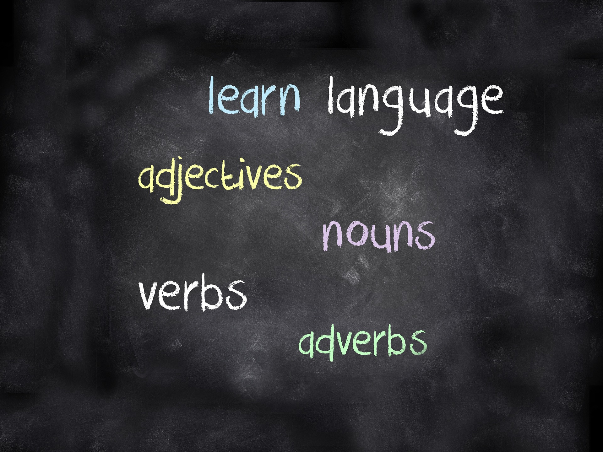

## HTML

### 介绍：

`html`中文全称为**超文本标记语言**，它不是编程语言，而是一种标记语言

> 如何理解呢？
**语言**:是用来交流沟通的工具，像英文、中文、日文、韩文等等统统都是语言，上述的是人与 人之间交流的工具，而`html`语言是用来和浏览器沟通交流的语言

英语,欧美国家的沟通

****

html，人类和浏览器沟通

****

>**文本**：文本文件是计算机中的一个文件，只能够用来记录文字信息，不可以记载图片、颜色、游戏、音乐、视频等